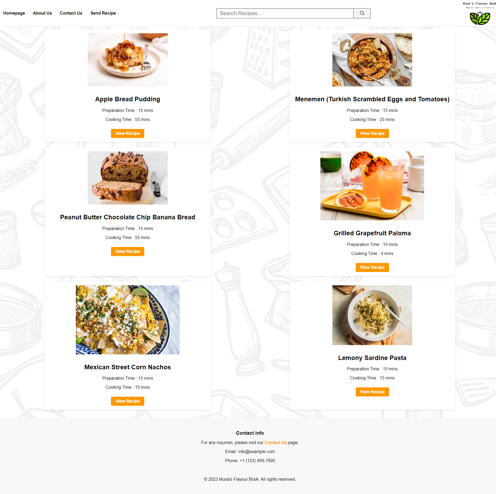
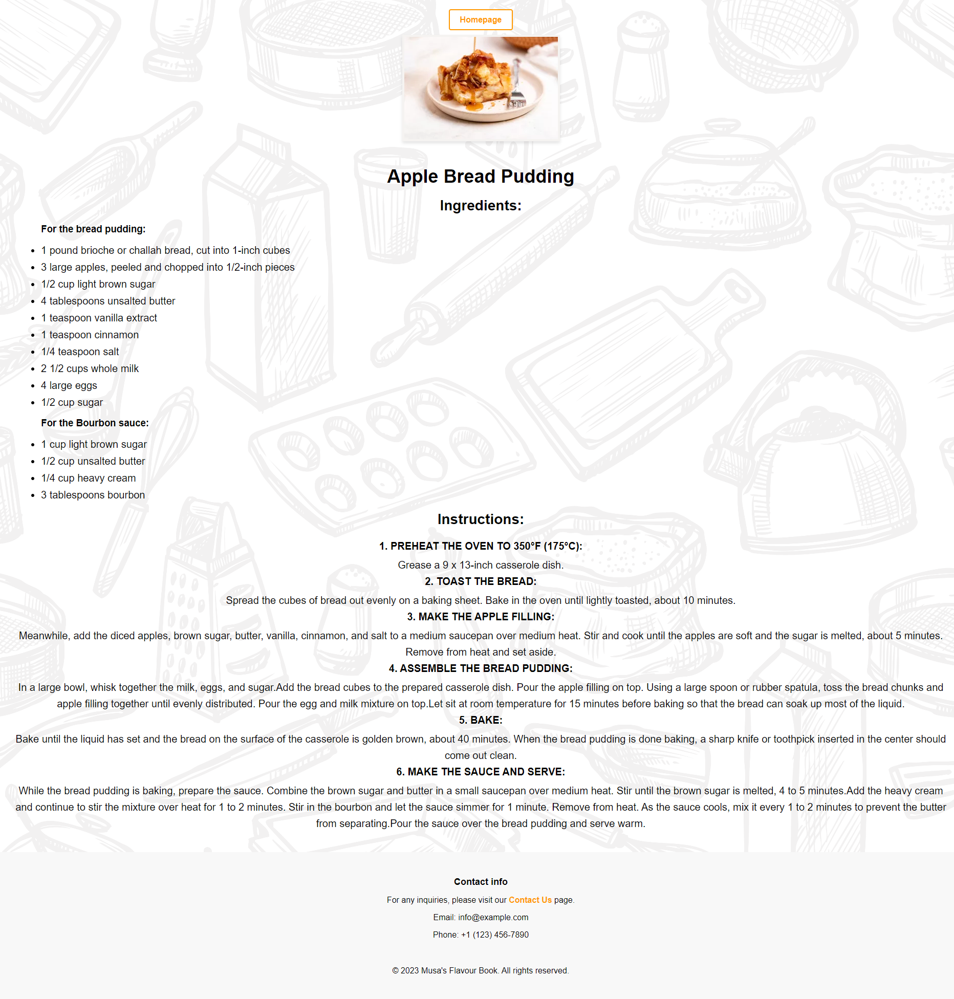
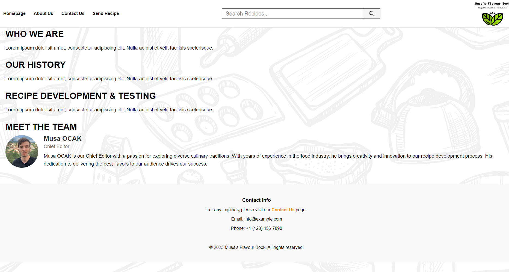
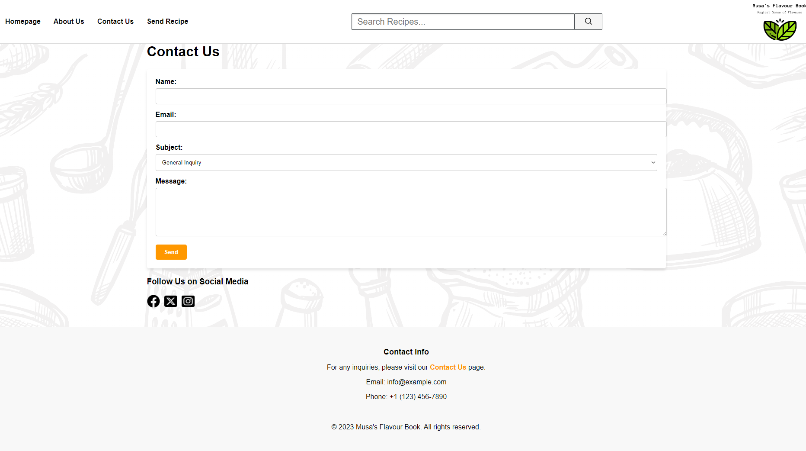
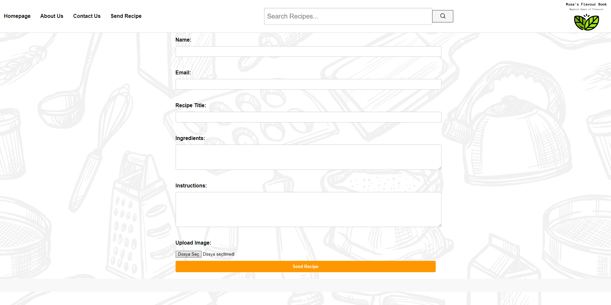

# Musa's Flavour Book - Recipe Sharing Platform

This project aims to create a web platform where users can share and discover food recipes. Users can add their own recipes, search for recipes, and explore recipes shared by other users.

## Features

- Homepage: Users can view the most popular recipes.
- Recipe Detail Page: Users can see the details of each recipe, including the ingredients and instructions.
- About Us Page: Learn more about the platform and its purpose.
- Contact Us Page: Contact information and a contact form to connect with other users.
- Submit Recipe Page: A form for users to submit their own recipes.

## Installation

1. Clone or download this project to your computer.
2. Navigate to the project directory: `cd musas-flavour-book`
3. Open the `index.html` file in your web browser to start the project.

## Technologies Used

- HTML
- CSS
- JavaScript

## Screenshots

## Notes
- Please note that the Contact Us and Send Recipe pages in this project are currently static and consist only of visual content. The contact form and recipe submission functionality have not been implemented in the current version of the project. You can explore these pages for design and layout purposes, but interactive features are not available at this time.

- We are continuously working on improving and adding new features to the platform, and updates may be released in the future to enhance the functionality of these pages.

- If you have any questions or feedback, please feel free to contact us at: info@example.com

## Contact

If you have any questions or feedback, please email us at: musaocak1@gmail.com

---

© 2023 Musa's Flavour Book. All rights reserved.
